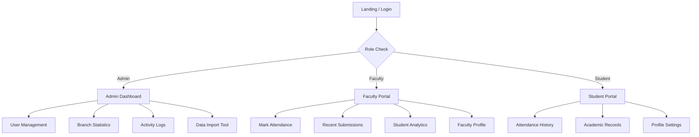

# 🎓 ALIETAKE - College Management System

A state-of-the-art, high-performance web application designed for comprehensive college management. Built with **Next.js 14**, **Firebase**, and **Tailwind CSS**, it provides seamless attendance tracking, academic monitoring, and administrative control with a focus on speed and user experience.

---

## 🗺️ Website Structure & Sitemap



### 📍 Key Routes
-   **`/`** (Auto-redirects to Login)
-   **`/login`** - Intelligent Authentication Portal (supports Student/Faculty/Admin auto-detection).
-   **`/register`** - New User Onboarding with real-time registry validation.
-   **`/dashboard/admin`** - Master control center with live activity feeds and spotlight UI.
-   **`/dashboard/faculty`** - Faculty hub for marking attendance and viewing analytics.
-   **`/dashboard/faculty/attendance`** - Optimized attendance marker with bulk actions and lateral entry support.
-   **`/dashboard/student`** - Personalized student portal for attendance and academics.
-   **`/import-students`** - Bulk data ingestion utility for institutional migrations.

---

## 🚀 Key Features

### ⚡ Performance & UX (New!)
-   **Optimistic UI Updates**: Instant visual feedback on attendance submissions and user deletions—no waiting for database round-trips.
-   **Fast-Feeling Loading Bars**: Intelligent progress indicators that jump to 70% instantly to signify responsiveness.
-   **Skeleton Screens**: Beautiful, shimmering placeholders that prevent layout shift during data fetching.
-   **Real-Time Synchronization**: Live updates across all dashboards using Firestore Listeners and Realtime Database.

### 👨‍💼 Admin Dashboard
-   **Spotlight Interface**: Modern dark mode with a custom interactive cursor effect.
-   **Live Activity Logs**: Real-time monitoring of system-wide logins and critical actions.
-   **Smart User Management**: Edit, delete, and promote users with immediate interface updates.
-   **Branch Analytics**: Dynamic student counts across all 8 engineering branches (CSE, IT, ECE, EEE, etc.).

### 🎓 Attendance Engine
-   **Intelligent Branch Detection**: Automatically identifies branch and year from registration numbers.
-   **Lateral Entry Support**: Correctly identifies 2nd-year joiners and calculates their current academic year.
-   **Bulk Operations**: Mark entire classes as present or absent in a single click.
-   **History Tracking**: 2-hour edit window for faculty with detailed absentee lists.

---

## 🛠 Tech Stack

| Layer | Technology |
| :--- | :--- |
| **Framework** | Next.js 14 (App Router) |
| **Language** | TypeScript |
| **Styling** | Tailwind CSS (Dark Mode + Custom Animations) |
| **Primary DB** | Firebase Firestore (Persistent Data) |
| **Live Sync** | Firebase Realtime Database (Instant Updates) |
| **Auth** | Firebase Auth (Google OAuth + Email/Pass) |
| **Icons** | Lucide React |

---

## 🏁 Getting Started

### Installation

1.  **Clone & Install**:
    ```bash
    git clone <repository-url>
    npm install
    ```

2.  **Environment Setup**:
    Create `.env.local` and add your Firebase config:
    ```env
    NEXT_PUBLIC_FIREBASE_API_KEY=your_key
    NEXT_PUBLIC_FIREBASE_AUTH_DOMAIN=your_project.firebaseapp.com
    NEXT_PUBLIC_FIREBASE_PROJECT_ID=your_project
    ...
    ```

3.  **Run Development**:
    ```bash
    npm run dev
    ```

---

## 🔒 Database Architecture

The system utilizes a hybrid Firebase approach for maximum efficiency:

### Firestore (Persistent Data)
-   **`users/`**: Core user profiles and role configurations.
-   **`attendance/`**: Historical attendance records indexed by date.
-   **`logs/`**: Detailed activity logs for administrative auditing.
-   **`admin/students/{branch}/`**: Optimized student directory organized by engineering discipline.

### Realtime Database (Live Data)
-   **`attendance/{date}/{branch}/{year}/{section}`**: Instant synchronization for live class monitoring and department-wide visibility.

---

## 📂 Project Directory Structure

```text
ALIET-ATTENDANCE/
├── app/                    # App Router Pages & Layouts
│   ├── dashboard/         # Role-Specific Interfaces
│   ├── login/             # Auth Pages
│   └── register/          # User Onboarding
├── components/            # UI Component Library
│   ├── ui/               # LoadingBar, Skeleton, Spotlight
│   └── auth/             # Role Wrappers
├── context/              # Global State (Auth, Theme)
├── data/                 # Static JSON Assets
├── lib/                  # Service Configs (Firebase)
├── utils/                # Business Logic Helpers
└── public/               # Static Assets & PWA Config
```

---

## 📜 License & Legal

© 2026 **ALIET College**. Designed and Developed for Advanced Campus Management. All rights reserved.

